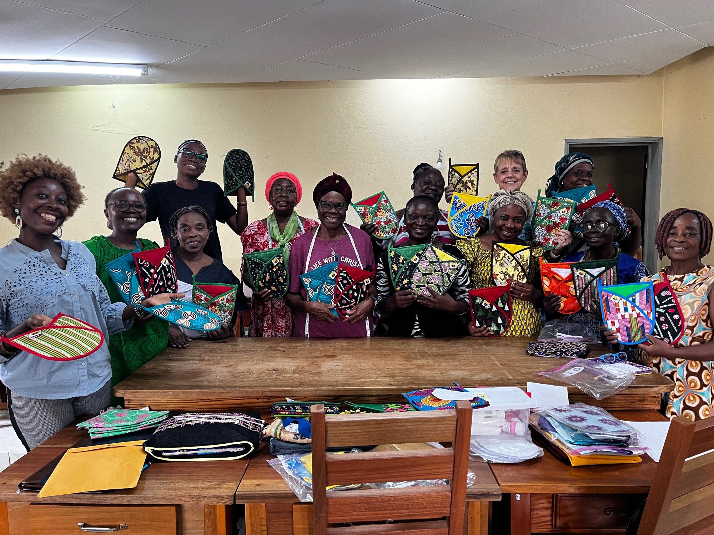
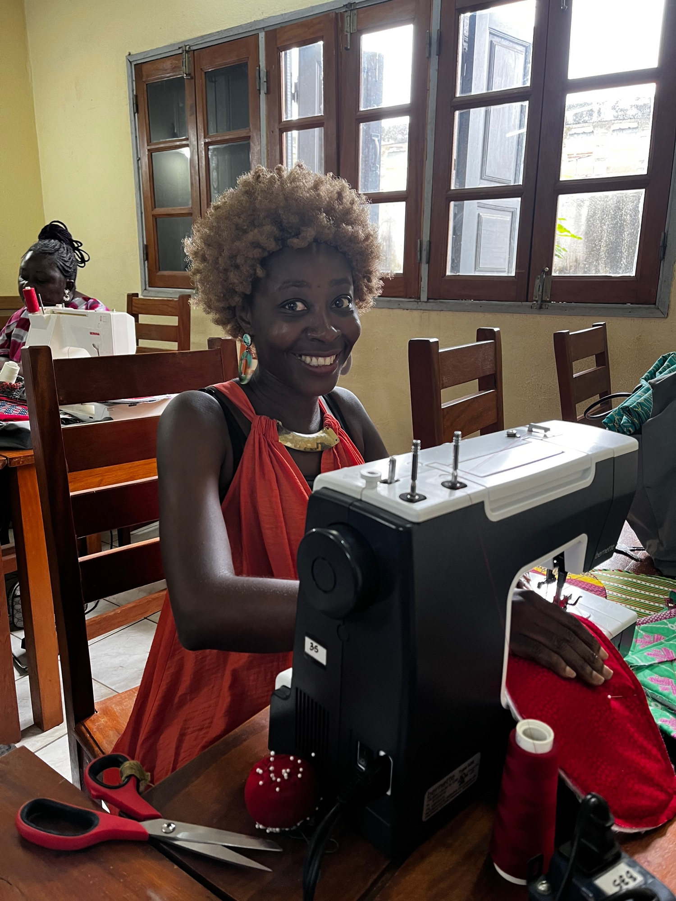
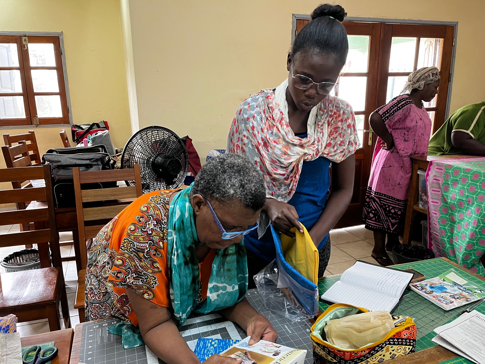
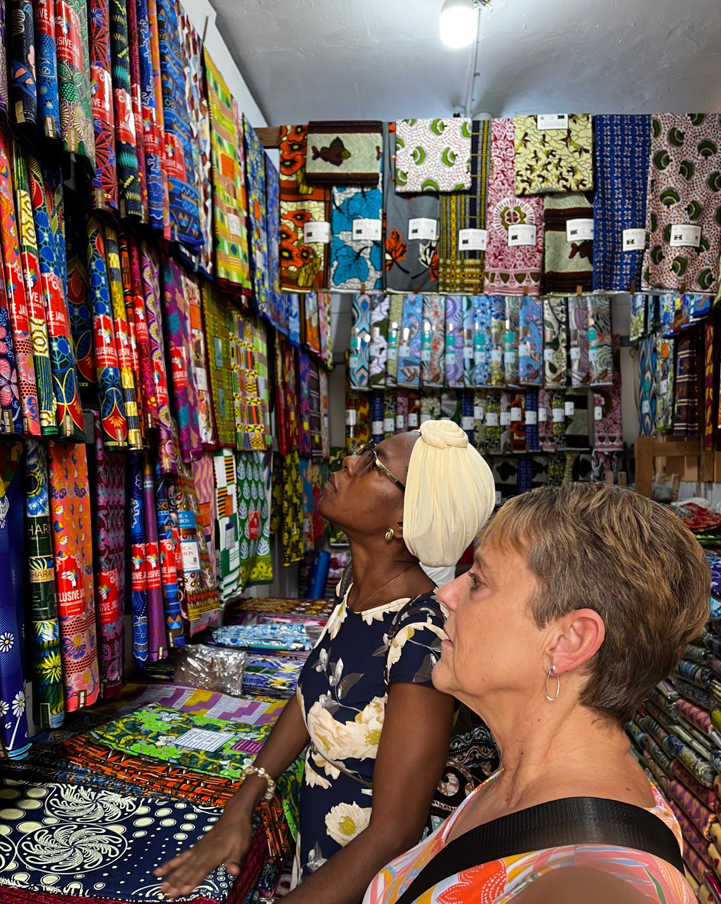
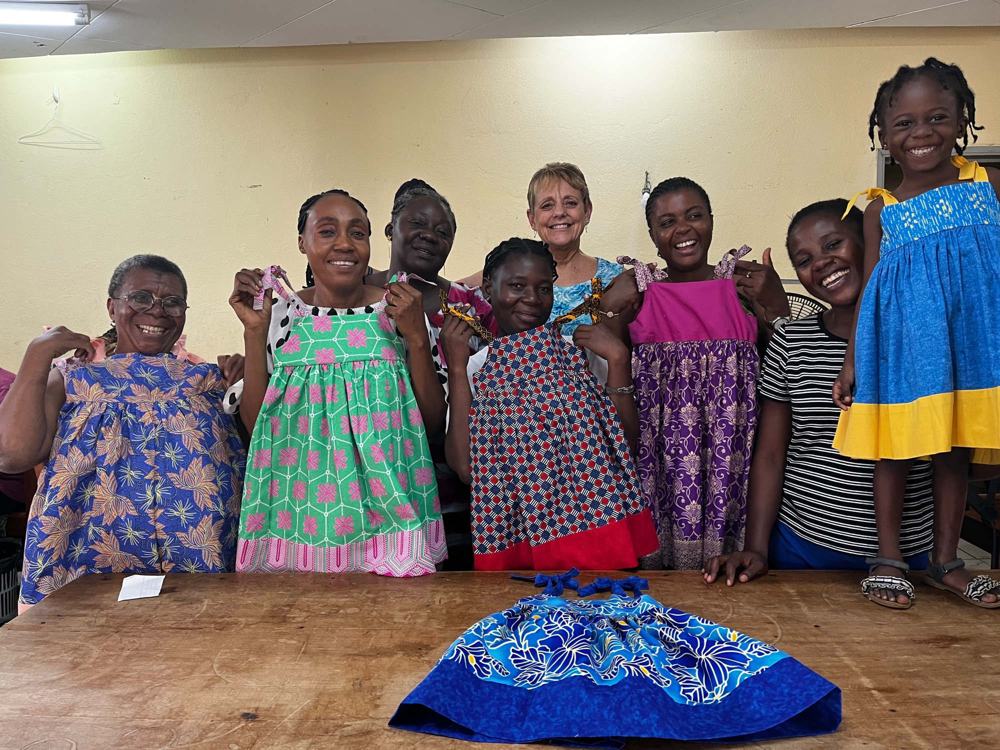

Dear Hands of Grace Supporter,

We would like to thank you for your outpouring of love and support this past year for Hands of Grace Ministry.

I am excited to share this update about the ministry we serve in Libreville, Gabon, Africa.  Our team trip for September 2025 ended up being just myself in November 2025 due to health issues in the family.  Our plans are to return to Libreville, Gabon and Hands of Grace Ministry April 27-May18, 2026.  Our team is Vicki Quellhorst (15th trip), Sandy Meyer (4th trip) and Tim Quellhorst (5th trip).  We will be working with the board members in their various positions.  Vicki will be teaching a mens trouser class and a dressmaking class and Sandy will be teaching a beginner baby quilt class.  Tim will be repairing machines and irons.  All three of us will meet with the National Church there to discuss more of the future of Hands of Grace.

On the trip in November, I had the privilege of having lunch with the president of the National Church in Gabon, Pastor Ferdinand Sangoye.  We are working on the paperwork needed to establish a partnership with the National Church.  Pastor Sangoye has a wonderful vision for Hands of Grace and would like to see a Hands of Grace Center in each of the 9 provinces.  We have decided that Port Gentil would be the second center.  Together, with the help of God, we are working on establishing the plans for this and will keep you all updated.  Please pray for a rent-free building in Port Gentil.  I was asked to speak at the Gabon CMA National Church Synod in July 2026.  So, this will mean another trip back to Gabon then.

At the center, the Hands of Grace Board has been working hard to have the center running smoothly. Splitting the responsibilities amongst the board members has proved to be effective.  Some highlights of the November trip was my beginner class occasionally breaking out in praise songs.  This was a reminder of the earlier days of teaching at the center when the members were less focused on the project being taught.  All of the students were very ready to learn.  Another highlight, was listening to God in my free time as He directed me to lead all the members in the sinner's prayer.  One beginner student accepted the Lord as her personal Savior.

Hands of Grace members continue to grow in faith, both their sewing and business skills and in their partnerships.  They continue to have sales every month.  When I speak at places in the US, we always have a sales table of their items. While I was there, I was able to visit the progress on the kiosk (store).  The tiling has been finished and a back door and window have been added.  It is a slow process, but we are hopeful to keep the renovations going until completion.

Back in the US, Together with Grace has added their first church partnership, and we have been abundantly blessed by this congregation.  St. Peter’s Church in New Bremen, Ohio asked us to speak for their Mission Focus for the month of February.  After the service, we had a sales table at their Souper Bowl lunch.  There was so much interest in the mission we serve and we give God the glory. Their prayer group has individually teamed up with the Hands of Grace board and will be texting each other encouragement through WhatsApp.  Due to the different languages, their prayer group was taught how to translate texting.

Together with Grace has 4 business partnerships.  Sew Nice in Upper Sandusky, Believe Art from the Heart in Sidney, Cozy Cabin Quilts in St. Marys and Heavenly Stitches in Lima.  Please support these businesses as they support the mission. I brought back 30 pieces of Gabon pagne fabric for Heavenly Stitches to sell in their store.  The fabric from Africa sells for $12 a yard and $5 per yard goes back to Hands of Grace Ministry.  Cozy Cabin Quilts recently held another quilt raffle for us. Let me know if you are interested in these raffles when they happen.

Once again, for the next training, we will be doing the student sponsorship program for classes.  This time the fee will be $40 per student.  If you would like to sponsor the same student as before, please let me know as soon as you receive this letter so I can hold that name for you.  And please, sponsor only one student so others can have the same opportunity.  The ladies at the center request a photo of their class sponsor.

Beyond the stitches, we have some prayer requests and opportunities to help Hands of Grace. Pray for our team…for safety and good health before the trip and while we travel.  For all of us to be good witnesses for God as we minister to those around us.  For God to be the focus in all we do.

Lunch is provided daily at the center.  This is the only meal some of our members get that day.  The rice is approximately $60 per bag and lasts 2-3 months.  Chicken and fish are served 2-3 days per week.  Fruits and vegetables are brought in from the gardens of the members.  Pray for our funds to continue to support these meals.

Pray for the Hands of Grace Board members as we work at fine tuning their responsibilities and job descriptions.

Pray for the beginners as they learn to sew but more importantly that they come to know Jesus and start their faith journey.

JOIN OUR TRAINING TEAM.  In Spring 2027, we will be sending another team to Hands of Grace in Libreville, Gabon.  Space is limited.  If you are interested in joining us, we will need to know as soon as possible so we can get you ready.  Please pray about this opportunity to help train and call Vicki if you are interested

The list of supplies needed at Hands of Grace center is as follows:

- 5 Dressmaker Sheers (these can be new or used-we can sharpen them) $16 each
- 6 Olfa Rotary Cutters $17 each
- 6 18x24 Cutting mats $34 each
- 6 Olfa Frosted 6x24 ruler $25 each
- Cold and flu medications (Equate from Walmart)
- 2 Boxes Schmetz Sewing Machine Needles (100 count) $35 each
- Insulbright potholder batting (any amount) bolts can be purchased from Sew Nice in Upper Sandusky (call Heidi and Vicki will pick it up)

All support is tax deductible with your check made payable to Together With Grace.  And, 100% of your donation will go directly to Hands of Grace Ministry.  Please let us know if you do not need a receipt.  Some of you will want me to purchase supplies for you.  Those checks can be made payable to Vicki Quellhorst.

I hope this letter, in some way, shows you what God can do when we work together for His purpose.  Our teams have been blessed to serve at the Hands of Grace center over the years, but more importantly, we are blessed by the unwavering support.  We are grateful to each one of you who have partnered with us to continue God’s mission to Hands of Grace and are looking forward to what He has for the future.

Serving Him Together,

Vicki Quellhorst

Coordinator for Hands of Grace

