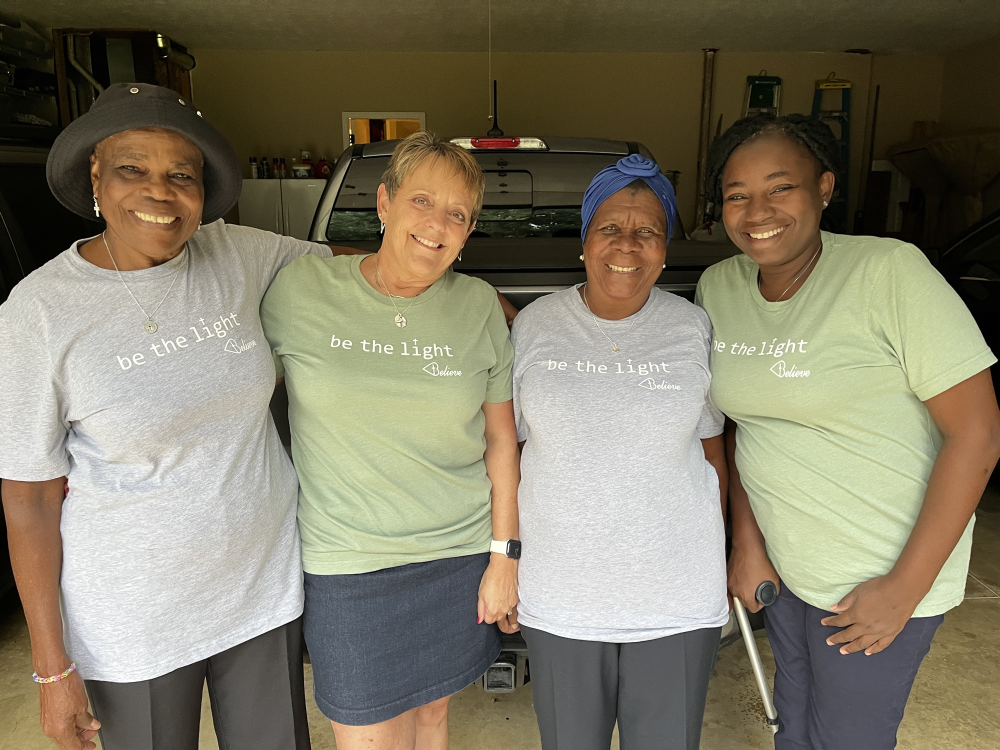
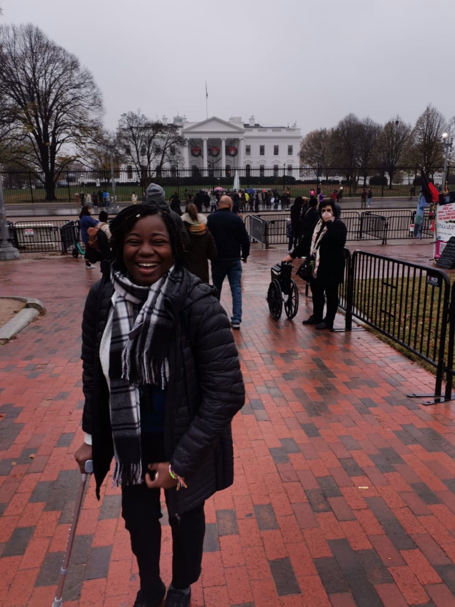
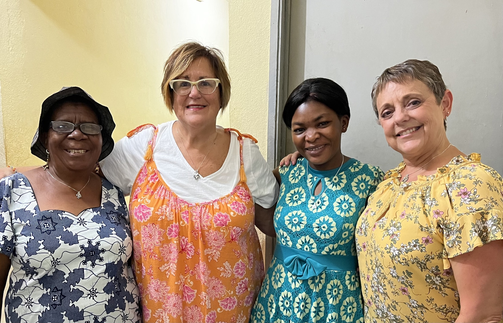

It brings me great joy to report their progress at the center over the past 9 months.  Our first stage of sustainability is going well (they are paying the electric bill with their profits).  We hope to add another monthly bill soon.  Praise God!  Their sewing and business training is now paying off.  Please pray for them as they continue to make progress to sustainability.

As most of you are aware, 3 ladies from the center (Marie Gabrielle-manager, Denise and Elisabeth) purchased their own airline tickets and came to the US mid-June to mid-July this year.  They spoke at 13 different events including 4 churches in Ohio, Michigan and Pennsylvania.  They had a sales table at each event and were able to sell a total of $4800 of their products while they were here.  Thank you if you made a purchase or donated to these ladies in any way.  They were very grateful to see the support Hands of Grace has here and to meet each one of you.

Hands of Grace has had new opportunities presented to them for growth in Gabon.  First, they have partnered with an artist to make the base portion of her lamps.  The base is a stuffed elephant or turtle.  Second, they have partnered with Libreville Airport Gift Shop to sell their products.  Third, they have a contract to make bed runners and shams for a 130 room hotel in Libreville across from the US Embassy.  This same hotel will have a showcase of their items for sale in their lobby.  All of these people contacted them directly.  Praise God they are getting their name out.  Back in the states, they have partnered with Believe, Art from the Heart in Sidney, Ohio.  Believe is selling their dolls in their store.  We are excited to partner with them and they were happy to meet our ladies this summer.

The new kiosk (storefront) is still not open.  Upon checking into the taxes needed to open, it would be better for the store entrance to be on the opposite side facing the church.  It would then be considered part of the church complex and no taxes would be charged.  This kiosk is owned by the church.  We are still pursuing this option and the repairs to the kiosk will still need to be finished.  But God continues to open doors for expositions around the city where they can sell their products.

As you can see, God has provided new opportunities for this ministry.  It was wonderful to hear the testimonies this summer of how God is working in the lives of the members at the center.  We heard testimonies of several new members accepting Christ as their personal Savior, a marriage being restored, a mother-in-law relationship nurtured, several members being led to mentor other members to follow God’s plan for them, love being shown, learning to work together and sharing in the goodness of God.

In November this year, Marie Gabrielle (manager at the center) was given an award by the US Embassy in Gabon and AWEP (African Women Entrepreneurship Program) to attend Leadership Training in the USA.  We praise God for providing this opportunity for her.  She arrived in Washington DC on December 2. Her training took her to Iowa, and she ended the training in Buffalo, NY on December 13.  She flew from Buffalo to Detroit on December 13 and is spending Christmas with us before heading back to Libreville on December 31.  We are so happy to have her here again this year.

Once again, we have some prayer requests and opportunities to help at Hands of Grace.

- Sandy Meyer, Tim and I are planning to return to Gabon in April 2024.  Our plans are to continue sewing skill training and business training.  Please pray for our upcoming trip.
- We would like to continue providing the lunch at the center due to it being an only meal for some of the members.  The rice is $55 per bag and lasts the center 2-3 months. The ladies bring in fruits and vegetables from their gardens and we serve meat (fish and chicken) 2-3 days a week. Please pray that our funds will continue to support this.
- We will be sending quality supplies back with Marie Gabrielle that they cannot get there.
- We are looking for monthly supporters for the center until they can become sustainable.

Right now, it takes approximately $1,500 each month for their expenses and to pay their manager.  We have support for $600 each month and are trusting God to provide the rest.  So please pray for this request.

All support is tax deductible with our new non-profit, Together With Grace.  And, unlike most non-profit organizations, 100% of any donations will go directly to Hands of Grace.  We are asking for all donations to go through Together With Grace so we can have a better account of the donations. Just let us know if you will not need a receipt.  Also, in mid-January we hope to have our website up and running and there will be the ability to donate online at togetherwithgrace.org.

Thank you so much for your continued support of this ministry, both financially and through prayer.  My hope is that you can see how God allows us to work together for His glory.  Our teams have been blessed to share our God-given skills with Hands of Grace.  It has been an awesome journey as we have watched God work and change the lives of these women.  I am so grateful for each one of you who have partnered with us to continue God’s mission to the Hands of Grace Ministry.  You have been a blessing as I have watched God work through you.

If you have any questions about the changes being made for the future, please do not hesitate to give me a call.

Serving Him Together,

Vicki Quellhorst, President

Together With Grace

