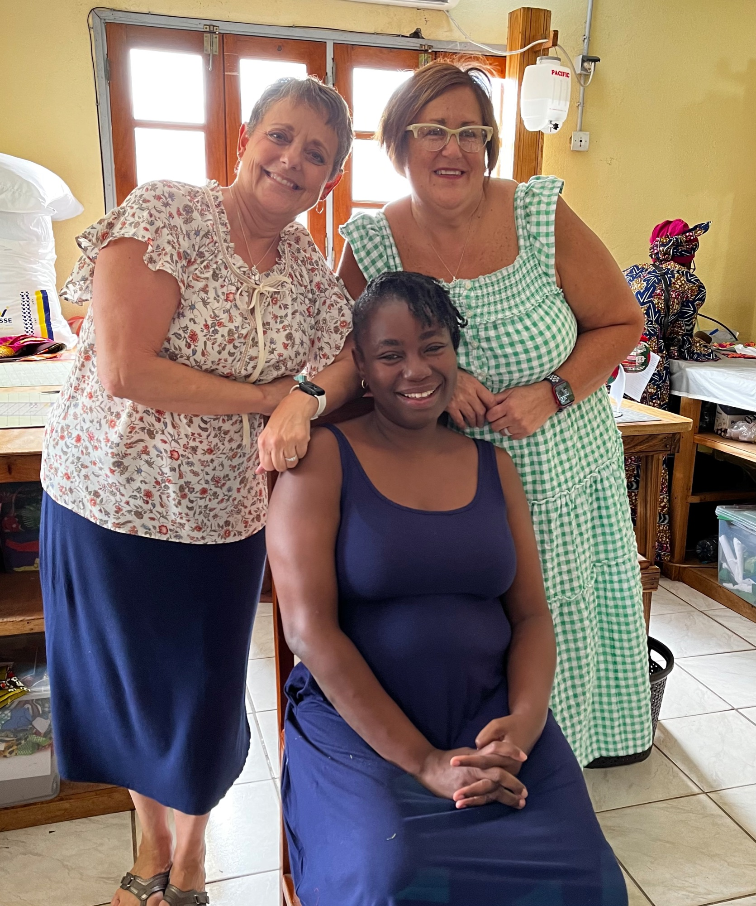
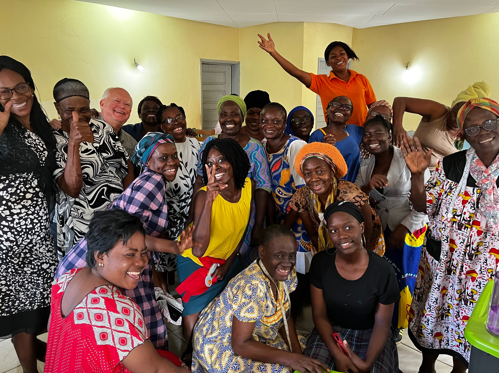

Dear Hands of Grace Supporter,

I am excited to share an update with you about our partnership with Hands of Grace Ministry in Libreville, Gabon, Africa. We were unable to make the team trip happen in April due to unforeseen circumstances in Gabon. So, our plans are to return to Libreville, Gabon and Hands of Grace Ministry August 26-September 18, 2024. This will be our first trip with Together with Grace as our partner organization. The team consists of Vicki and Tim Quellhorst and Sandy Meyer. We have all been there before and hope to make a difference in the lives of the ladies at the center.

We will be attending the wedding of one of the Hands of Grace members, Celine, on August 31. We hope to meet with the National Church to establish the future of Hands of Grace. Sandy and I will, once again, be advancing the sewing skills at the center with classes from beginner to advanced students. Tim will be helping with machine and iron repairs, and he will also meet with Steve Straw who is a pilot flying patients and doctors to Bongolo Hospital. A beach picnic for Hands of Grace members is planned at the Straw’s for September 14. I have been asked to speak at a church women's group about “Sharing the Gifts God has Given” and at least one church service. All of us are excited to share our skills and continue to build our relationships in Gabon. We are also hoping to hear more testimonies of how God is working at the center that we can share with you in the future.

Our website is up and running. You can view it at togetherwithgrace.org. There are lots of pictures of the ladies at the center and some ways you can help and get involved. We are also able to accept online donations.

Hands of Grace continues to grow both in their sewing and business skills and in their partnerships. This is the first year that they have seen sales in every month. Their partnership with the Libreville Airport Gift Shop brings in sales each month along with fresh ideas for creating new items. They continue to sell their items at expositions around the city and they also receive special orders. They are getting well known for their quality and customer service.

The new kiosk (storefront) is still not open, and we hope to meet with Nzeng Ayong Church leadership (owners) when we are there to possibly move this project along.

We will continue with the student sponsorship program for our sewing classes. This time the fee will be $40 per student due to needing templates for the classes. Some of you paid to sponsor a student in April 2023 and the trip was postponed. Those of you who paid to sponsor in 2023 would only need to contribute $10 to sponsor this time. We have 27 students signed up for classes, so we are in need of more sponsors. Also, the ladies at the center are requesting a picture of their sponsor so they can pray for you daily.

Once again, we have some prayer requests and opportunities to help Hands of Grace:

- Pray for our team…for safety and good health while we travel. For each of us to be a blessing to the ladies at the center. For God to be the center focus of all we do. For God to get the glory for all that is accomplished.
- We would like to continue providing the lunch at the center due to it being the only meal some members get for the day. The rice is $55 per bag and lasts the center 2-3 months. The ladies bring in fruits and vegetables from their gardens and meat (chicken and fish) is served 2-3 days each week. Please pray that our funds will continue to support this meal.
- We are looking for more monthly supporters to run the center until they can become sustainable. We do not know when this will be. They are currently paying the electric bill each month which is our first step. We hope to add another bill soon. It takes approximately $1500 each month for their expenses and the managers salary and right now we have support for $910 each month and are trusting God to provide the rest. Please pray for this request.
- For the ladies at the center to grow in their faith and learn to trust Jesus for their every need.

The list of supplies needed for Hands of Grace is as follows:

- 10 Olfa 45mm rotary cutters $15 each
- 2 pkg. 45mm rotary cutter blades (10 per pkg) $14 each
- 8” Dressmaker shears (these can be new or used-we can sharpen them)
- 6 boxes glass head pins $6 each
- 2 boxes Schmetz Sewing machine needles size 80/12 (100/box) $32 each
- Bright colored solid 100% cotton fabrics

All support is tax deductible with your check made payable to Together with Grace, and 100% of any donations will go directly to Hands of Grace Ministry. Please let us know if you do not need a receipt. Some of you are wanting me to purchase supplies for you. Those checks can be made payable to Vicki Quellhorst.

Thank you for your continued support of this ministry, both financially and prayerfully. I hope you can see how God allows us to work together for His purpose. Our teams have been blessed to share our God given talents in Gabon. We are grateful to each one of you who have partnered with us to continue God’s mission to the Hands of Grace Ministry. It has blessed my heart to watch God work through you.

Serving Him Together,

Vicki Quellhorst

*President Together with Grace*

