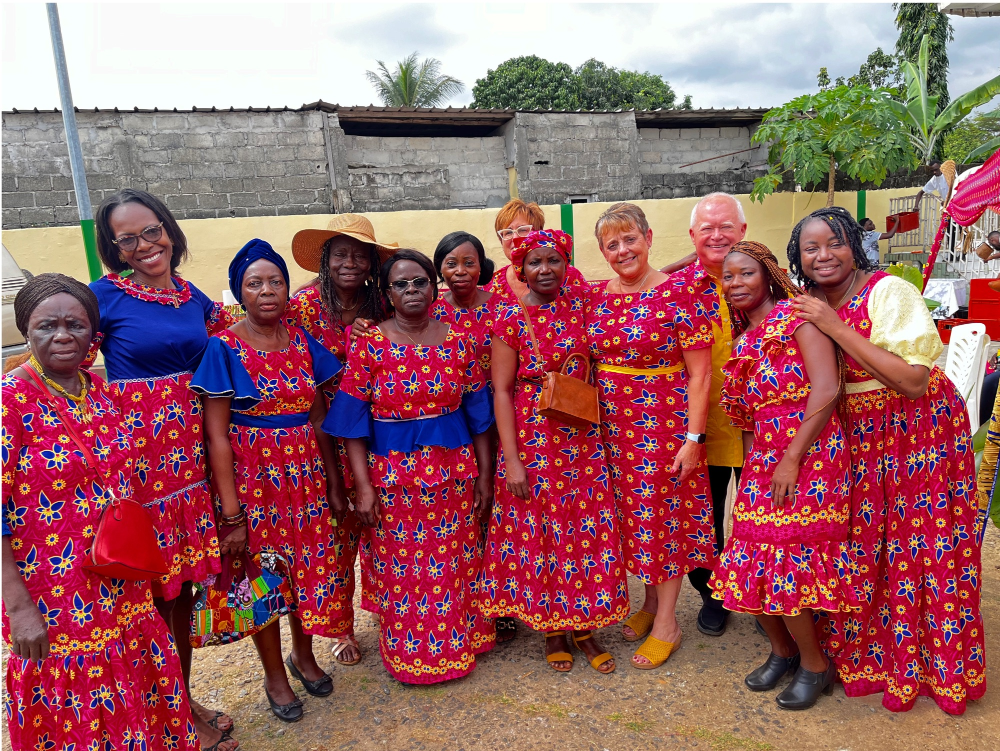
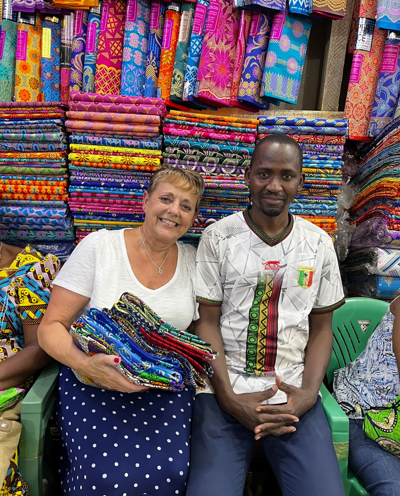
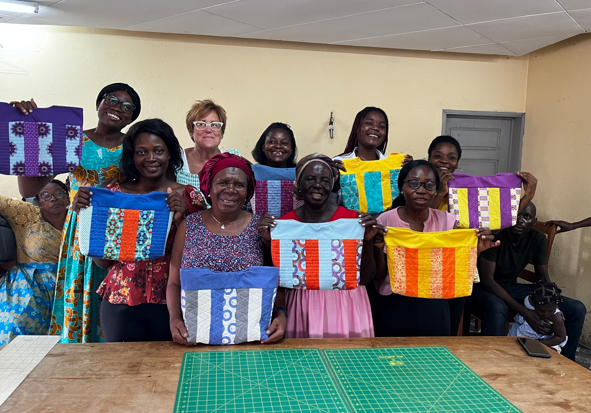

I am excited to share an update about the ministry we serve in Libreville, Gabon, Africa. We were unable to make a spring trip this year due to the presidential elections in Gabon and an unforeseen health issue here. Our plans are to return to Libreville, Gabon and Hands of Grace Ministry September 24-October 15, 2025. This will be our second trip with Together With Grace as our partner organization. This team will be just the Quellhorsts. It will be Vicki’s 13th trip and Tim’s 5th trip. We will be working with the board members of Hands of Grace in their various positions. Vicki will be teaching a binding class and a beginner class and Tim will be repairing machines and irons. We will meet with the National Church to establish the future of Hands of Grace. Vicki will speak at a womens group at a church there. We are both excited to share our faith and our God given skills and hear testimonies of how God is working at the center.

On our trip in August 2024, we were able to give some relief to the manager and the many duties she had. Marie Gabrielle helped us divide her obligations with the board at Hands of Grace. Although she remains a board member, she is now our translator and assistant reporting clerk. This transition of duties to the board members has made a big difference in getting all the work finished in a timely matter. We now have a production overseer and production recorder, someone in charge of machine maintenance, inventory control, reporting clerk, courier and housekeeping. They are all doing well with their positions and monthly reporting in their various positions has been on time. Obviously, this was Gods plan all along.

We went in August last year to attend the wedding of one of our members, Celine. It was a fun celebration as we all dressed in the brides fabric (their tradition) for the wedding. The center was in the process of an update while we were there and therefore, we only had a couple of days to teach classes. But, the trip was very productive and was a great learning experience.

Hands of Grace continues to grow in both their sewing and business skills and in their partnerships. They continue to have sales every month. The Libreville Airport Gift shop continues to carry their items, they made aprons for Hearing the Call ministry in the United States, they provide items for Madie Home in France, and continue to work with the doll maker in Canada. We, here in the states, have spoken at several places and sell their items when we do presentations.

Back in the US, Together with Grace now has 4 partnerships. Sew Nice in Upper Sandusky, Believe Art from the Heart in Sidney, Cozy Cabin Quilts in St Marys and we recently added Heavenly Stitches LLC in Lima. Please support these businesses as they support us. Heavenly Stitches had a Give Back Event in July and they were able to raise 76 yards of brand new fabric and several spools of thread for the ministry. They also raffled a quilt for Hands of Grace. Cozy Cabin Quilts will be raffling a quilt soon. We are hoping to add some churches to our partnerships soon.

I’m excited to report that the work on their kiosk (storefront) in the Libreville market district has begun. They have added a door and two windows and the next step is tiling the floor. Hopefully, this will be completed this fall and we can open soon.

Once again, we will be doing the student sponsorship program for the sewing classes. This time the fee will be $30 per student. I have not received a class count yet. If you would like to sponsor the same student as before, please let me know as soon as you receive this letter so I can hold that name for you. And please, sponsor only one student so others can have the same opportunity. Also, the ladies at the center are requesting a picture of their sponsor so they can pray for you daily.

Beyond the stitches, we have some prayer requests and opportunities to help Hands of Grace:

1. Pray for Vicki and Tim…for safety and good health while we travel. For both of us to be a good witness for God as we minister to the people in Libreville and at the center. For our focus to be on God and what He wants us to accomplish. For God to get the glory in all that we do.

2. Lunch is provided at the center daily. This is sometimes the only meal some of our members get that day. The rice is approximately $60 per bag and lasts the center 2-3 months. Fruits and vegetables are brought in by the members from their gardens and meat (chicken and fish) is served 2-3 day per week. Please pray that our funds continue to support this meal.

3. We are looking for more monthly supporters to help run the center until they can become sustainable. We do not know when this will be. They are currently paying for the electric and water bill. It takes approximately $1300 each month for their expenses. Please pray for this request.

4. Pray for Hands of Grace board members for understanding, as we work at fine tuning their job descriptions.

5. Pray for the beginner students as they learn to sew. And pray for our members at the center as they grow in their faith so they are able to share the love of Jesus with those around them. May they learn to trust Jesus for their every need.

6. JOIN OUR TEAM. In Spring 2026, we will be sending another team to Hands of Grace in Libreville, Gabon. Space is limited. If you are interested in joining us, we will need to know as soon as possible so we can get you ready. Please pray about this opportunity to help and call Vicki if you are interested in joining us.

The list of supplies needed at Hands of Grace is as follows:

- 10 Machine cleaning brushes (10 for $8.60)
- 15 Sewing machine oil pens $3.68 each
- 5 Embroidery scissors $8 each
- 5 Dressmaker Sheers (these can be new or used-we can sharpen them) $16 each
- 5 Tomato pin cushions $1.25 each
- 10 Boxes glass head pins (long) $6 each
- 5 Olfa 45mm rotary cutters $16 each
- Heat and Bond Lite (any amount) 5.25 yards/$13
- Tear Away (any amount) 50 yards/$21
- Insulbright (potholder batting-any amount)
- Sew on snaps (size 0 & 1) 72 sets/$8.50

All support is tax deductible with your check made payable to Together With Grace. And, 100% of any donation will go directly to Hands of Grace Ministry. Please let us know if you do not need a receipt. Some of you will want me to purchase supplies for you. Those checks can be made payable to Vicki Quellhorst.

Thanks again for your unwavering support of this ministry, both prayerfully and financially. I hope this letter, in some way, shows you what God can do when we work together for His purpose. Our teams have been blessed to serve at the Hands of Grace center over the years. We are grateful to each one of you who have partnered with us to continue God’s mission to Hands of Grace. I love having a front row seat to watch God work through His people.

Serving Him Together,

Vicki Quellhorst, President

Together With Grace

